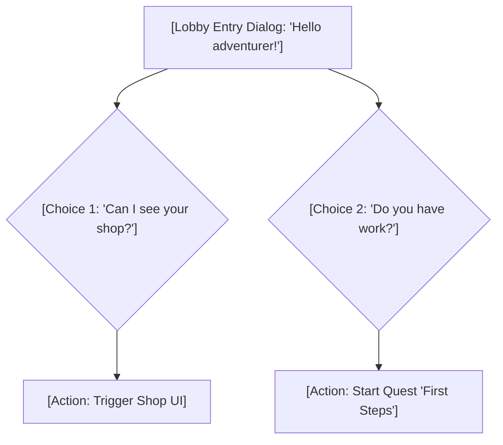

# Narrative Spec: [Lore Element / Character Name]

---

## 🎭 Profile
* **Name / Title:** `[Character or Element Name]`
* **Role in World:** `[e.g., Quest Giver, Final Boss, Legendary Weapon]`
* **Visual Description:** `[Describe look, clothing, scale, textures, accessories]`

---

## 📜 Storyline / Backstory
`[Describe the lore background of this character or element in detail.]`

---

## 🗣️ Dialog Nodes (FSM Graph)
`[For characters: detail dialogue options, player response choices, and trigger outcomes (e.g. starting a quest, opening a shop).]`



#### Dialogue Script Schemas:
```
[NPC]: "Hello! What can I do for you today?"
- Player: "I'd like to browse your shop." -> OpenShop()
- Player: "Do you have any tasks for me?" -> CheckQuests()
```
