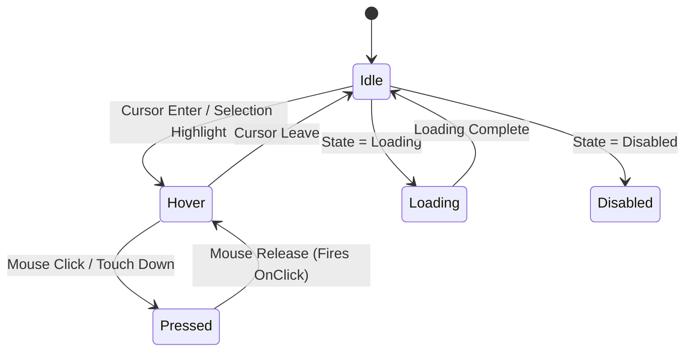

# UI Component Blueprint: Button

> [!NOTE]
> Standard button component supporting multiple visual variants, interactive state machine tweens, icon integration, and sound feedback.

---

## 🛠️ Props & API Contract Schema (Luau Types)

```lua
export type ButtonVariant = "Primary" | "Secondary" | "Ghost" | "Danger"
export type ButtonSize = "Small" | "Medium" | "Large"

export type ButtonProps = {
    Text: string,
    Variant: ButtonVariant?,
    Size: ButtonSize?,
    IconId: string?,
    Disabled: boolean?,
    Loading: boolean?,
    OnClick: (() -> ())?,
}
```

---

## 🌳 Roblox Instance Tree Hierarchy

```
TextButton (Root)
├── UICorner (CornerRadius: UDim.new(0, 8))
├── UIStroke (Thickness: 2px, ApplyStrokeMode: Border)
├── UIPadding (PaddingLeft: 12px, PaddingRight: 12px, PaddingTop: 8px, PaddingBottom: 8px)
├── UIListLayout (FillDirection: Horizontal, HorizontalAlignment: Center, VerticalAlignment: Center, Padding: 8px)
├── ImageLabel (Icon - Optional)
│   └── UIAspectRatioConstraint (1:1)
├── TextLabel (Button Label Text)
└── Sound (ClickSFX - SoundId: rbxassetid://[SoundID])
```

---

## 🎨 Visual Design Tokens & Variants

| Variant | Background Fill (Hex / HSL) | Border Stroke Color | Text Color | Usage |
| :--- | :--- | :--- | :--- | :--- |
| **Primary** | `#00aaff` `HSL(200, 100%, 50%)` | `#ffffff` (20% Opacity) | `#ffffff` | Main CTA (Play, Save, Confirm) |
| **Secondary** | `#2a2a2a` `HSL(0, 0%, 16%)` | `#444444` | `#e0e0e0` | Neutral options (Cancel, Settings) |
| **Ghost** | `Transparent` | `Transparent` | `#00aaff` | Text-only link buttons |
| **Danger** | `#ff3355` `HSL(350, 100%, 60%)` | `#ff8899` | `#ffffff` | Destructive actions (Delete, Reset) |
| **Disabled** | `#1a1a1a` `HSL(0, 0%, 10%)` | `#2d2d2d` | `#666666` | Non-interactive state |

---

## 🎭 State Machine & Interactive Tweens



| State | Visual Feedback | Tween Style & Duration | Audio Event |
| :--- | :--- | :--- | :--- |
| **Hover** | Scale `1.05x`, Fill Brightness `+10%` | `Sine Out (0.15s)` | Hover Tick `rbxassetid://[SoundID]` |
| **Pressed** | Scale `0.95x`, Fill Brightness `-15%` | `Quad Out (0.1s)` | Click SFX `rbxassetid://[SoundID]` |
| **Loading** | Label hidden, Spinner rotates continuously | `Linear (1.0s loop)` | None |
| **Disabled** | Scale `1.0x`, Opacity `0.5`, Input ignored | `None` | None |

---

## 📱 Accessibility & Touch Targets
* **Minimum Touch Boundary:** Mobile hitboxes must be at least `44x44` pixels.
* **Gamepad Selection:** Set `SelectionImageObject` to a rounded neon highlight outline.
