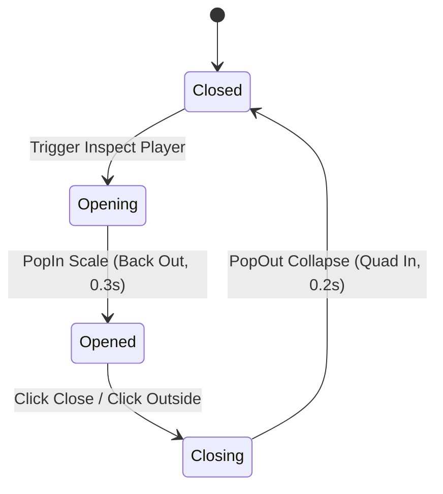

# UI Component Blueprint: Player Profile Card

> [!NOTE]
> Component for player info popup dialogs, custom leaderboard inspect cards, and user stats detail panels.

---

## 🛠️ Props & API Contract Schema (Luau Types)

```lua
export type PlayerStats = {
    Level: number,
    Coins: number,
    Wins: number,
}

export type PlayerProfileCardProps = {
    UserId: number, -- Used to fetch Roblox Avatar Headshot dynamically
    DisplayName: string,
    Username: string,
    Stats: PlayerStats,
    CanTrade: boolean?,
    CanSpectate: boolean?,
    OnClose: () -> (),
    OnTrade: (() -> ())?,
    OnSpectate: (() -> ())?,
}
```

---

## 🌳 Roblox Instance Tree Hierarchy

```
Frame (Card Container Frame - Size {0, 320, 0, 180})
├── UICorner (CornerRadius: UDim.new(0, 12))
├── UIStroke (Thickness: 2px, ApplyStrokeMode: Border, Color: Hex #3a3a4a)
├── UIGradient (Deep charcoal glassmorphism background gradient)
├── TextButton (Close Button - Position Top-Right/Top-Left)
│   ├── UICorner (CornerRadius: UDim.new(1, 0) - Circle)
│   └── ImageLabel (X Close Icon)
├── ImageLabel (Player Avatar Thumbnail Headshot)
│   ├── UICorner (CornerRadius: UDim.new(1, 0) - Circle)
│   └── UIStroke (Circular border outline)
├── TextLabel (Player Display Name)
├── TextLabel (Player @Username)
├── Frame (Stats Container Grid / List)
│   ├── UIListLayout (Horizontal grid slots)
│   ├── Frame (StatSlot - e.g. Wins)
│   └── Frame (StatSlot - e.g. Level)
└── Frame (Actions Row - Optional)
    ├── UIListLayout (Horizontal alignment)
    ├── TextButton (Spectate Button)
    └── TextButton (Trade Button)
```

---

## 🎨 Visual Looks & Aesthetics (Anti-Polos Guidelines)

The player card must never be a plain solid color box. Always implement premium detailing:

1. **Avatar Headshot Loading**:
   - Use `Players:GetUserThumbnailAsync(userId, Enum.ThumbnailType.HeadShot, Enum.ThumbnailSize.Size150x150)` to load the character's real face image.
   - Wrap the image in a circle (`UICorner` Scale 1.0) with a neon border accent.

2. **Glassmorphism Backdrop & Stroke Glow**:
   - Frame background uses a subtle diagonal `UIGradient` (e.g. HSL Charcoal `RGB(28, 32, 45)` to dark blue-gray `RGB(18, 20, 30)`) with 20% translucency.
   - `UIStroke` adds a slim, glowing edge border (`RGB(120, 110, 255)` with 50% opacity).

3. **Close Button ("X") Micro-Animation**:
   - Close button sits neatly in the corner. Hovering rotates it `90 degrees` clockwise. Clicking bounces it slightly down.

---

## 🎭 State Transitions & Interactive Tweens



| Event / Action | Animation Effect | Easing & Duration | SFX |
| :--- | :--- | :--- | :--- |
| **Open Card** | PopIn scale spring from `0.6 -> 1.0` | `Back Out (0.3s)` | PopOpen sound |
| **Close Card** | PopOut scale collapse from `1.0 -> 0.0` | `Quad In (0.2s)` | PopClose sound |
| **Hover Buttons** | Action buttons scale up `1.05x` | `Quad Out (0.15s)` | Hover Tick sound |
| **Close Hover** | Close "X" button rotates `90 degrees` | `Sine Out (0.2s)` | None |
