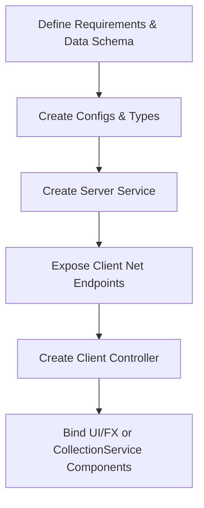

# Workflow: Creating a New Feature

This workflow outlines the step-by-step procedure the coding agent must follow when creating a new game system or feature in the Roblox Vibescoding Framework.

## Step-by-Step Procedure

### Step 0: Read Relevant Local Specialist Skills (`.agents/skills/`)
1. Identify all engineering domains involved in this feature (e.g. `software-architect`, `roblox-engineer`, `ui-designer`, `backend-engineer`, `security-engineer`, `performance-engineer`).
2. Use `view_file` (with `IsSkillFile = true`) to read the corresponding `.agents/skills/<domain-name>/SKILL.md` instruction file(s) before writing any code.

### Step 1: Define Configs & Types
1. If the feature requires data schemas, declare them in `src/shared/Types/SharedTypes.luau`.
2. Add any balance values or settings to `src/shared/Configs/GameConstants.luau` or a dedicated config file under `Configs/`.

### Step 2: Implement Server Logic (Service)
1. Write a new module script in `src/server/Services/` matching the **[Server Service Pattern](file:///d:/Experiments/Roblox%20AI%20Framework/.agents/patterns/service-pattern.md)**.
2. Initialize player data structures, connect to the database, and write state validations.
3. Expose client methods or events inside the `Client` table using `Net:Event()` or `Net:Function()`.

### Step 3: Implement Client Logic (Controller & UI)
1. Write a new module script in `src/client/Controllers/` matching the **[Client Controller Pattern](file:///d:/Experiments/Roblox%20AI%20Framework/.agents/patterns/controller-pattern.md)**.
2. Connect to the service's remote endpoints via `Net` to sync states.
3. Bind inputs and render visual cues (sound playbacks, UI updates).

### Step 4: Add Reusable Behavior (Components)
1. If the feature interacts with objects in the Workspace, tag them in Roblox Studio.
2. Write a CollectionService component under `src/server/Components/` or `src/client/Components/` matching the **[Component Pattern](file:///d:/Experiments/Roblox%20AI%20Framework/.agents/patterns/component-pattern.md)** to manage behavior dynamically.
