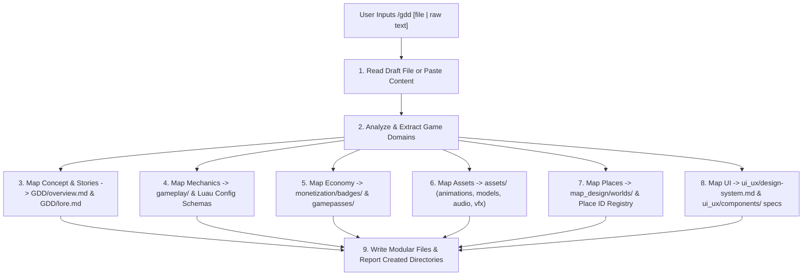

# Workflow: GDD Knowledge Base Parsing & Formatter (`/gdd`)

> [!NOTE]
> This workflow details how the AI Coding Agent ingests unstructured game design notes/drafts and maps them into the modular `.agents/GDD/` AI Knowledge Base.

---

## 🎯 Purpose & Scope
The `/gdd` command transforms raw, unstructured game ideas, text pastes, or design documents into a clean, domain-separated **AI-Readable GDD Knowledge Base** adhering to the principle: **"One domain, one folder, one responsibility."**

---

## 📊 GDD Parsing & Mapping Pipeline

---

## 📝 Step-by-Step Procedure

### Step 1: Input Ingestion
* **File Input**: If input matches a filepath (e.g. `/gdd docs/my-game-idea.md`), use file viewing tools to read the full untruncated content.
* **Text Input**: If input is pasted text, process the text directly.

### Step 2: Domain Extraction & Formatting

#### A. Core Concept & Narrative (`GDD/`)
* Extract Executive Summary, Core Loop steps, Target Audience, and **User Stories** (*As a... I want to... So that...*).
* Write formatted spec to [.agents/GDD/GDD/overview.md](file:///d:/Experiments/Roblox%20AI%20Framework/.agents/GDD/GDD/overview.md).
* Extract character lore, NPC dialogue choices, and narrative beats into [.agents/GDD/GDD/lore.md](file:///d:/Experiments/Roblox%20AI%20Framework/.agents/GDD/GDD/lore.md).

#### B. Gameplay Systems & Luau Config Schemas (`gameplay/`)
* Identify distinct game mechanics (e.g., Combat, Inventory, Farming, Mining, Fishing, Pets).
* For each system, create a dedicated folder under `.agents/GDD/gameplay/[system-name]/README.md`.
* Include a **Luau Data Structure Configuration** section showing `export type` and `table.freeze()` code mockups.

#### C. Monetization & Progression (`monetization/`)
* Extract Badges, unlock requirements, and technical triggers into `monetization/badges/README.md`.
* Map badge rewards to `monetization/badges/rewards.md`.
* Extract Gamepasses (one-time) and Developer Products (repeatable) into `monetization/gamepasses/README.md`.
* Map Robux-to-USD conversion matrices into `monetization/gamepasses/pricing.md`.

#### D. Asset Registries (`assets/`)
* Sort asset references into their respective domain registries:
  * Animations (Track priorities, IDs) ➔ `assets/animations/README.md`
  * Audio (SFX, ambient tracks, volume) ➔ `assets/audio/README.md`
  * Models (3D meshes, collision rules) ➔ `assets/models/README.md`
  * VFX (Particles, beams, shaders) ➔ `assets/vfx/README.md`

#### E. Map Design & Cross-World Specs (`map_design/`)
* Identify Place IDs (Lobby/Menu, Main Game, Trade Hub).
* Document lighting properties (Ambient, OutdoorAmbient, Shadows) and post-processing effects (DepthOfField, Bloom) into templates.
* Write dedicated place/world files at `.agents/GDD/map_design/worlds/[world-name].md` using `templates/world-spec.md`.

#### F. UI/UX & Component Blueprints (`ui_ux/`)
* Extract brand palette colors (HSL/Hex), typography, and easing styles into `ui_ux/design-system.md`.
* Map screen UI mockups to dedicated files under `ui_ux/components/[screen-name].md` using `templates/screen-spec.md` (detailing Left/Right panels, Dynamic Camera Focus tables, Input/Navigation behaviors, and rotation behaviors).
* Reference component blueprints (`button.md`, `card.md`, `dialog.md`, `hotbar.md`, `progress-bar.md`, `slider.md`, `tab-bar.md`, `tooltip.md`, `player-card.md`, `leaderboard.md`).

#### G. Dynamic Custom Domain Extensions
* If the draft describes unique systems (e.g., Crafting, Skill Trees, Guilds), dynamically create new domain subfolders inside `.agents/GDD/` (e.g. `.agents/GDD/crafting/README.md`).

#### H. Mandatory User Stories
* **Mandatory constraint**: EVERY individual UI component spec file and Map world spec file MUST contain its own clear User Story section (`As a ... / I want to ... / So that ...`) to define player intent and value.

### Step 3: File System Synthesis & Output
* Write all populated files to `.agents/GDD/`.
* Output a clear summary report listing all created/updated files and folders.

---

## 🚫 Anti-Patterns
* **Do NOT write monolithic files**: Never dump everything into a single 5000-line GDD file. Split specs into domain folders.
* **Do NOT omit Luau Config Schemas**: Every gameplay mechanic MUST include a Luau code block showing the suggested config table schema.
* **Do NOT omit User Stories**: Do not leave individual UI or World spec files without a dedicated player-facing User Story section.
