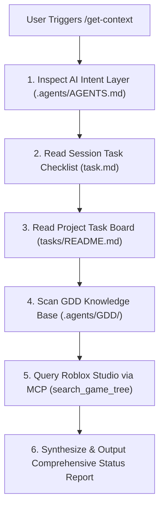

# Workflow: Synchronizing Workspace & Roblox Studio Context (`/get-context`)

> [!NOTE]
> This workflow defines the step-by-step context aggregation procedure for AI Coding Agents upon receiving the `/get-context` slash command or starting a new pair-programming session.

---

## 🎯 Purpose & Scope
The `/get-context` command provides the AI Coding Agent with a 360-degree real-time understanding of:
1. **AI Framework Intent & Rules**: Reading [AGENTS.md](file:///d:/Experiments/Roblox%20AI%20Framework/.agents/AGENTS.md) and active specialist skills (`.agents/skills/`).
2. **Current Active Agent Session State**: Inspecting [task.md](file:///C:/Users/farre/.gemini/antigravity/brain/72460545-d628-47ad-ae4b-cb3f39cbb400/task.md).
3. **Project Master Task Board**: Parsing [tasks/README.md](file:///d:/Experiments/Roblox%20AI%20Framework/tasks/README.md) and pending task files (`tasks/XXX-name.md`).
4. **Game Design Knowledge Base**: Scanning all domain specifications under `.agents/GDD/` (`GDD/`, `gameplay/`, `monetization/`, `assets/`, `map_design/`, `ui_ux/`).
5. **Live Roblox Studio Explorer State**: Querying the active Roblox Studio session via `roblox-studio` MCP tools (`get_studio_state` / `search_game_tree`) to inspect live instances in `ReplicatedStorage`, `ServerScriptService`, `StarterPlayerScripts`, and `Workspace`.

---

## 📊 Context Flow Diagram

---

## 📝 Step-by-Step Procedure

### Step 1: Intent & Guidelines Parsing
* Read [AGENTS.md](file:///d:/Experiments/Roblox%20AI%20Framework/.agents/AGENTS.md) to load core framework constraints:
  * Dynamic remotes via `Net.luau`
  * Single-entry bootstrappers via `Loader.luau` and `Registry.luau`
  * Zero-trust server validation boundaries
  * Senior Luau commenting rules

### Step 2: Task Board Audit
* Read [task.md](file:///C:/Users/farre/.gemini/antigravity/brain/72460545-d628-47ad-ae4b-cb3f39cbb400/task.md) for current conversation progress.
* Read [tasks/README.md](file:///d:/Experiments/Roblox%20AI%20Framework/tasks/README.md) to classify tasks:
  * **To Do**: Pending roadmap items.
  * **In Progress**: Active task currently being edited or verified.
  * **Completed**: Verified past implementations.

### Step 3: GDD Knowledge Base Inspection
* Recursively scan `.agents/GDD/`:
  * **`GDD/overview.md`**: Game concept pitch, core gameplay loops, target audience, user stories.
  * **`GDD/lore.md`**: Backstory, NPC characters, and dialogue states.
  * **`gameplay/`**: Technical gameplay mechanics, formulas, and Luau config table mockups.
  * **`monetization/`**: Badges, unlock rewards, gamepasses, and Robux pricing matrices.
  * **`assets/`**: Pre-loading rules, animation priorities, 3D models, sound effects, and particle VFX registries.
  * **`map_design/`**: Place IDs, lighting parameters (Ambient, Shadows), post-processing, spawn anchors.
  * **`ui_ux/`**: Design tokens (HSL/Hex palette, fonts, tweens) and UI component blueprints (`button.md`, `card.md`, `dialog.md`, `hotbar.md`, `progress-bar.md`, `slider.md`, `tab-bar.md`, `tooltip.md`).

### Step 4: Live Roblox Studio Inspection via MCP
* Call `roblox-studio` MCP tool `search_game_tree` or `get_studio_state`.
* Inspect live instance tree hierarchy:
  * `ReplicatedStorage.Shared`: Verify `Core`, `Network`, `Packages`, `Configs`, `Utilities`.
  * `ServerScriptService.Server`: Verify `Bootstrap`, `Services`, `Components`.
  * `StarterPlayerScripts.Client`: Verify `Bootstrap`, `Controllers`, `Components`.
  * `Workspace`: Verify spawned parts, tag bindings, and spawn points.

### Step 5: Output Synthesis & Report
Synthesize a concise, structured markdown report covering:
1. **Architecture Status**: Framework bootstrap health in local workspace & live Studio.
2. **Game Design Overview**: High-level game concept and active domain specs.
3. **Current Task Progress**: Active task in progress and top 3 upcoming tasks.
4. **Recommended Action**: Clear next step proposal for pair-programming.

---

## 🚫 Anti-Patterns & Error Handling
* **Do NOT guess live Studio state**: If Roblox Studio MCP is disconnected, report socket failure gracefully and advise running Studio with MCP plugin.
* **Do NOT omit GDD domain specs**: Always check `.agents/GDD/` subfolders so game balancing, UI styles, and place IDs are taken into account before writing Luau code.
