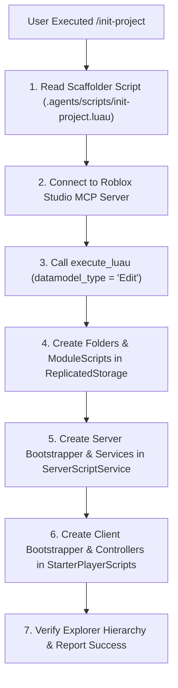

# Workflow: Native Roblox Studio Framework Scaffolding (`/init-project`)

> [!NOTE]
> This workflow details the native project initialization process that programmatically builds the entire bootstrapped framework tree inside an open Roblox Studio instance via MCP.

---

## 🎯 Purpose & Scope
The `/init-project` command automates the complete setup of the **Roblox Vibescoding Framework** inside Roblox Studio. It removes manual folder creation, script instantiation, and code copying, programmatically writing all core module sources directly into the active Roblox Studio DataModel.

---

## 📊 Scaffolding Control Flow



---

## 📝 Step-by-Step Procedure

### Step 1: Script Loading & Validation
* Read [.agents/scripts/init-project.luau](file:///d:/Experiments/Roblox%20AI%20Framework/.agents/scripts/init-project.luau).
* Verify that the scaffolder script embeds the exact source code for:
  * `Core/Loader.luau` & `Core/Registry.luau`
  * `Network/Net.luau`
  * `Packages/Maid.luau`, `Packages/Signal.luau`, & `Packages/Promise.luau`
  * `Configs/GameConstants.luau` & `Utilities/Tables.luau`
  * `Server/Bootstrap.server.luau` & `Services/ExampleService.luau` & `Components/ExampleComponent.luau`
  * `Client/Bootstrap.client.luau` & `Controllers/ExampleController.luau` & `Components/ExampleClientComponent.luau`

### Step 2: MCP Remote Execution
* Invoke lazy MCP tool `roblox-studio/execute_luau` with arguments:
  ```json
  {
    "datamodel_type": "Edit",
    "code": "[Contents of init-project.luau]"
  }
  ```

### Step 3: Explorer Hierarchy Generation
The scaffolder script programmatically constructs the following tree inside Roblox Studio:

```
Roblox Studio Explorer Tree
├── ReplicatedStorage
│   └── Shared
│       ├── Core
│       │   ├── Loader (ModuleScript)
│       │   └── Registry (ModuleScript)
│       ├── Network
│       │   └── Net (ModuleScript)
│       ├── Packages
│       │   ├── Maid (ModuleScript)
│       │   ├── Signal (ModuleScript)
│       │   └── Promise (ModuleScript)
│       ├── Configs
│       │   └── GameConstants (ModuleScript)
│       └── Utilities
│           └── Tables (ModuleScript)
│
├── ServerScriptService
│   └── Server
│       ├── Bootstrap (Script)
│       ├── Services
│       │   └── ExampleService (ModuleScript)
│       └── Components
│           └── ExampleComponent (ModuleScript)
│
└── StarterPlayer.StarterPlayerScripts
    └── Client
        ├── Bootstrap (LocalScript)
        ├── Controllers
        │   └── ExampleController (ModuleScript)
        └── Components
            └── ExampleClientComponent (ModuleScript)
```

### Step 4: Verification & Audit
* Inspect execution return string: `"Framework initialized successfully inside Roblox Studio!"`.
* Query Studio state via `search_game_tree` to confirm all folder nodes exist.

---

## 🚫 Anti-Patterns & Safety Guards
* **Never use Rojo/Wally**: Initialization is 100% native via Roblox Studio MCP.
* **Idempotent Execution**: `init-project.luau` uses `FindFirstChild` or creates missing nodes, safely preventing duplicate instance creation if re-run.
