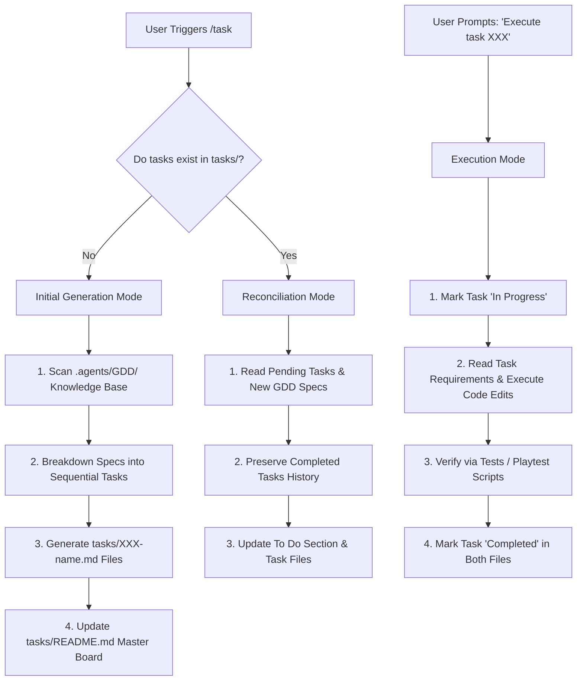

# Workflow: File-Based Task Generation & Execution Engine (`/task`)

> [!NOTE]
> This workflow details how the AI Coding Agent generates, reconciles, and executes file-based task roadmaps (`tasks/XXX-name.md`) from GDD specifications.

---

## 🎯 Purpose & Scope
The `/task` command breaks down high-level game design specifications into a sequential, file-based roadmap. It enforces two core engineering constraints:
1. **Extreme Technical Specifications**: Every task file must detail the exact UI panel placements, camera offsets, lighting parameters, database schemas, or asset IDs.
2. **Agile User Story Wrap**: Every task file must be wrapped in a player-facing User Story (*As a / I want to / So that*) to maintain feature purpose and logical ordering.

---

## 📊 Tasking Lifecycle Diagram



---

## 📝 Step-by-Step Operating Modes

### Mode 1: Initial Generation (`/task`)
* **Trigger**: Executed when `tasks/` contains no active task files.
* **Procedure**:
  1. Scan all domain files inside `.agents/GDD/`.
  2. Deconstruct features into isolated, sequential steps (e.g. Task 001: DataStore ProfileService Setup ➔ Task 002: Remote Net Event Declaration ➔ Task 003: Client Controller & UI State ➔ Task 004: CollectionService Components).
  3. Create individual task files at `tasks/XXX-name.md` following [task-blueprint.md.template](file:///d:/Experiments/Roblox%20AI%20Framework/tasks/task-blueprint.md.template).
  4. Write the master index at [tasks/README.md](file:///d:/Experiments/Roblox%20AI%20Framework/tasks/README.md) listing all tasks under `🔴 To Do`.

### Mode 2: Reconciliation (`/task` on Updated GDD)
* **Trigger**: Executed when GDD specs are updated or new features are added.
* **Procedure**:
  1. Read existing `tasks/README.md` and preserve all tasks listed under `🟢 Completed`.
  2. Compare pending `🔴 To Do` tasks against new GDD specifications.
  3. Update existing task files or append new task files (`tasks/XXX-name.md`) to reflect the new scope.

### Mode 3: Task Execution (*"Execute task XXX"*)
* **Trigger**: User prompts in chat: *"Execute task 001"* or *"Run task 002"*.
* **Procedure**:
  1. **Update Status to In Progress**: Mark status to `🟡 In Progress` in `tasks/README.md` and `tasks/XXX-name.md`.
  2. **Read Task Requirements**: Read the target task file completely.
  3. **Execute Code Changes**: Modify or create target Luau modules in `src/`.
  4. **Run Verification**: Perform automated tests or playtest verification in Roblox Studio.
  5. **Mark Completed**: Update status to `🟢 Completed` in both `tasks/README.md` and the task file.
  6. **Report**: Summarize completed work and highlight the next task in queue.

---

## 🛠️ Required Task File Structure (`tasks/XXX-name.md`)

Each generated task file MUST contain:
```markdown
# Task Spec: XXX - [Task Title]

## 📊 Status
* **Status:** `[Todo | In Progress | Completed]`

## 👥 User Story
* **As a** `[Player Type]`
* **I want to** `[Action]`
* **So that** `[Benefit]`

## 🎯 Objective
`[1-2 sentences concise goal]`

## 📋 Requirements
* **`[Requirement 1]`**: `[Detailed technical rule]`
* **`[Requirement 2]`**: `[Exact camera offset / UI panel position / lighting setting]`

## 📂 Proposed Changes
* **`[NEW]`** / **`[MODIFY]`** `[File Path]`

## 🧪 Verification Plan
* **Automated Verification**: `[Test script / Execute Luau test]`
* **Manual Verification**: `[Playtest steps]`
```
