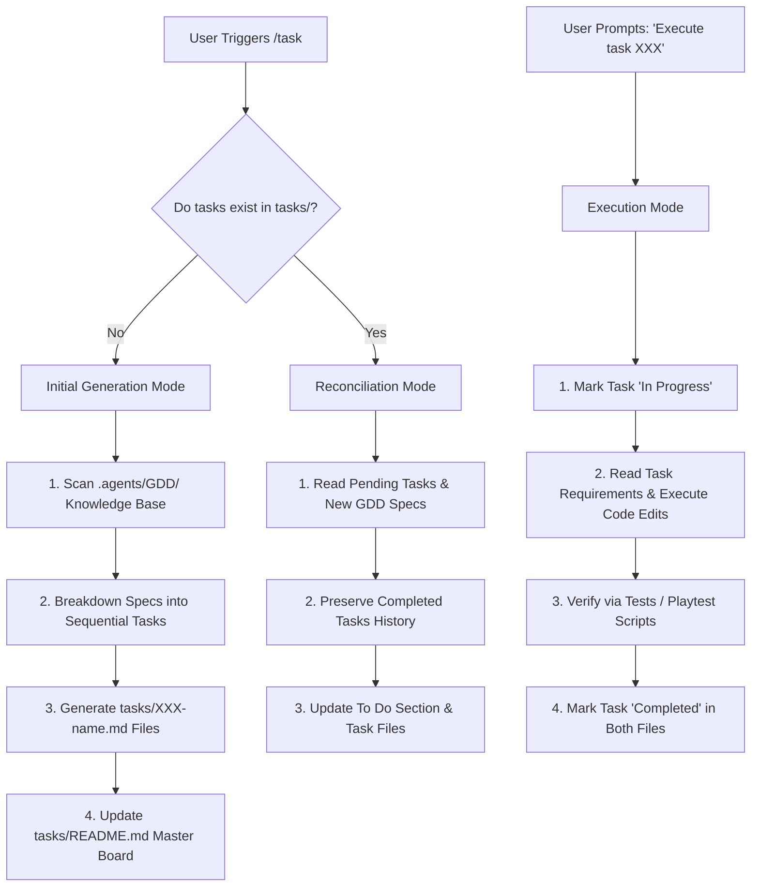

# Workflow: File-Based Task Generation & Execution Engine (`/task`)

> [!NOTE]
> This workflow details how the AI Coding Agent generates, reconciles, and executes file-based task roadmaps (`tasks/XXX-name.md`) from GDD specifications.

---

## 🎯 Purpose & Scope
The `/task` command breaks down high-level game design specifications into a sequential, file-based roadmap. It enforces two core engineering constraints:
1. **Extreme Technical Specifications & GDD Value Fidelity**: Every task file must detail exact UI panel placements, camera offsets, lighting parameters, color codes, database schemas, or asset IDs *if and only if explicitly defined in the GDD*. Do not invent arbitrary hardcoded values if not specified in the GDD.
2. **Agile User Story Wrap**: Every task file must be wrapped in a player-facing User Story (*As a / I want to / So that*) to maintain feature purpose and logical ordering.

---

## 📊 Tasking Lifecycle Diagram



---

## 📝 Step-by-Step Operating Modes

### Mode 1: Initial Generation (`/task`)
* **Trigger**: Executed when `tasks/` contains no active task files.
* **Procedure**:
  1. Scan all domain files inside `.agents/GDD/`.
  2. Enforce the **Exhaustive GDD Mapping Invariant**: Ensure every `.md` file in `.agents/GDD/` (maps, UI components, combat matrix, mutations, soundscapes, camera, mobile controls, shop catalog) is mapped to dedicated, hyper-detailed task files.
  3. Enforce **Extreme Technical Specification & GDD Value Fidelity**: Each task file MUST copy and detail exact RGBA/Color3 values, UI frame layouts, button keybinds, species scale multipliers, camera distance targets, skill damage numbers, status effect durations, sound asset IDs, and 3D rig template paths if and only if they are explicitly defined in the GDD. If a specific value (like a color code or offset) is NOT explicitly specified in the GDD, do NOT invent arbitrary hardcoded values; reference the central GDD design tokens or describe the functional visual requirement.
  4. Deconstruct features into a **Strict 5-Phase Sequential Roadmap**:
     * **Phase 1: Physical 3D Map & World Geometry Staging**:
       - Task 001: Map Geometry & Biomes Staging (Terrain, landmarks, sub-locations, spawns, and tagged zones in `Workspace.CurrentMap`).
       - Task 002: Physical Asset Templates & Rigs Staging (Pre-built 3D creature rigs, flora nodes, carcass props, nest base, and crystal templates in `ReplicatedStorage.Shared.Assets` per Rule 8).
     * **Phase 2: Lighting, Skybox & Atmospheric Setup**:
       - Task 003: Lighting, Atmosphere & Post-Processing (Future tech, Atmosphere, Sky, Bloom, DOF, SunRays, ColorCorrection in `Lighting`).
     * **Phase 3: UI Screens & HUD Visual Layout Staging (1 Task per UI Component Spec)**:
       - Separate staging tasks for every UI spec file in `ui_ux/components/` (Survival HUD with Mobile/iPad Touch Action Buttons layout, Evolution Tree Menu, Territory Panel, Shop & Emote Wheel Menu, Toast Notifications & Overhead Cards, Preloader & Loading Screen). (Note: NO custom leaderboard UI; use Roblox native top-right `leaderstats`).
     * **Phase 4: Gameplay Systems & Backend Services (1 Task per System Domain)**:
       - Separate Luau implementation tasks for: Core Bootstrappers & Net Remotes, Native Roblox Leaderstats (`Player.leaderstats` folder with DNA, Kills, Species), Cross-Platform Mobile & Touch Input Controller, Vitals Engine & Ecosystem Spawner, Evolution & Mutation System, Action Combat & Skill Engine, Dynamic World Events & Bosses, Hunting Party & Nest Territory Buffs, Dynamic Species Camera Controller, Spatial Audio & Biome Soundscape System, Client VFX & Particle Emitter Controller, and DataStore ProfileService & DevProduct/Gamepass Verification.
     * **Phase 5: Mock Multiplayer Bot Integration**:
       - Final Task: `MockPlayerService` autonomous bot simulation suite (10-20 bots, state machine, stress testing with zero errors in Studio).
  5. Create individual task files at `tasks/XXX-name.md` following [task-blueprint.md.template](file:///d:/Experiments/Roblox%20AI%20Framework/tasks/task-blueprint.md.template).
  6. Write the master index at [tasks/README.md](file:///d:/Experiments/Roblox%20AI%20Framework/tasks/README.md) listing all tasks under `🔴 To Do`.

### Mode 2: Reconciliation (`/task` on Updated GDD)
* **Trigger**: Executed when GDD specs are updated or new features are added.
* **Procedure**:
  1. Read existing `tasks/README.md` and preserve all tasks listed under `🟢 Completed`.
  2. Compare pending `🔴 To Do` tasks against new GDD specifications.
  3. Update existing task files or append new task files (`tasks/XXX-name.md`) to reflect the new scope.

### Mode 3: Task Execution (*"Execute task XXX"*)
* **Trigger**: User prompts in chat: *"Execute task 001"* or *"Run task 002"*.
* **Procedure**:
  1. **Update Status to In Progress**: Mark status to `🟡 In Progress` in `tasks/README.md` and `tasks/XXX-name.md`.
  2. **Read Task Requirements**: Read the target task file completely.
  3. **Execute Code Changes**: Modify or create target Luau modules in `src/`.
  4. **Professional SE Testing Protocol**:
     * **Unit/Integration Testing**: Run Luau unit testing scripts in Roblox Studio using MCP `execute_luau`.
     * **Visual & Scene Hierarchy Checks**: Inspect `StarterGui` or `Workspace` via tree search tools to verify staged UI and physical map assets.
     * **Roblox Studio Console Log Audit**: Trigger playtesting via MCP `start_stop_play` (if testing runtime logic), wait 3-5 seconds, and invoke MCP `get_console_output` to retrieve recent logs.
     * **Zero-Error Invariant Constraint**: The captured console logs **MUST contain exactly 0 red error traces or warn stack traces** originating from the modified or created modules. If errors are found, the task is NOT complete; revert status, fix code, and re-test.
  5. **Mark Completed**: Update status to `🟢 Completed` in both `tasks/README.md` and the task file.
  6. **Report**: Summarize completed work, paste the clean console log snippet as proof of verification, and highlight the next task in queue.

---

## 🛠️ Required Task File Structure (`tasks/XXX-name.md`)

Each generated task file MUST contain:
```markdown
# Task Spec: XXX - [Task Title]

## 📊 Status
* **Status:** `[Todo | In Progress | Completed]`

## 👥 User Story
* **As a** `[Player Type]`
* **I want to** `[Action]`
* **So that** `[Benefit]`

## 🎯 Objective
`[1-2 sentences concise goal]`

## 📋 Requirements
* **`[Requirement 1]`**: `[Detailed technical rule]`
* **`[Requirement 2]`**: `[Exact camera offset / UI panel position / lighting setting]`

## 📂 Proposed Changes
* **`[NEW]`** / **`[MODIFY]`** `[File Path]`

## 🧪 Verification Plan
* **Automated Verification**: `[Test script / Execute Luau test]`
* **Manual Verification**: `[Playtest steps]`
```
